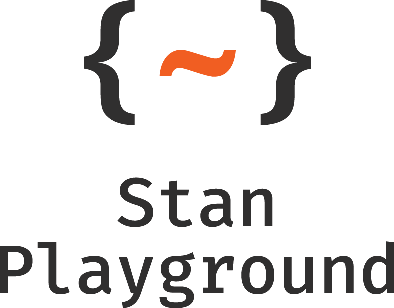

<picture>
  <source media="(prefers-color-scheme: dark)" srcset="./gui/public/StanPlay_Logo_RGB_White.png">
  
</picture>

# stan-playground

Run Stan models directly in your browser.

[Visit the live site!](https://stan-playground.flatironinstitute.org)

## Overview

Stan Playground enables you to run Stan sampling directly in your browser, eliminating the need for any local Stan installation. This is well-suited for teaching and learning purposes and for users who want to experiment with Stan models without the hassle of setting up a local environment. You can edit Stan programs, provide input data, set sampling parameters, and view the results—all within your browser. You can also provide Python or R code to generate the input data (this also runs in the browser) and use Python or R code to post-process the results and generate plots. You can then share your results with others using the GitHub Gist feature.

While the Stan models execute in the browser (on your local machine), the compilation process requires a dedicated server. We provide a default public server for your convenience, but you can also set up your own compilation server either locally or remotely.

This project is based on [stan-web-demo](https://github.com/WardBrian/stan-web-demo) which shows how to use [TinyStan](https://github.com/WardBrian/tinystan) to build a WebAssembly version of a Stan model that can be executed in the browser. While stan-web-demo focuses on integrating a specific Stan model into a website—essentially "baking" the model into the web environment—stan-playground is designed for a broader purpose. It offers a flexible platform for experimenting with and exploring various Stan models. This makes it ideal for users looking to test different statistical models and hypotheses directly in their browser, without the commitment to a single model implementation.

## Preparing links to existing models or projects

In addition to the built-in sharing feature which integrates with [Github Gists](https://docs.github.com/en/get-started/writing-on-github/editing-and-sharing-content-with-gists), you can also manually prepare links which will pre-populate each portion of Stan Playground when clicked by using [URL Parameters](https://developer.mozilla.org/en-US/docs/Learn/Common_questions/Web_mechanics/What_is_a_URL#parameters):

| Parameter | Use | Example | Notes |
|-----------|-----|:-------:|------:|
| `project`| Link to a github gist containing any subset of the project files |`https://gist.github.com/WardBrian/e47253bf29282d0eabf13616265d393e` | Cannot be combined with other url parameters |
| `stan` | Link to a Stan model | `https://raw.githubusercontent.com/stan-dev/cmdstan/develop/examples/bernoulli/bernoulli.stan` | |
| `data` | Link to a data.json file | `https://raw.githubusercontent.com/stan-dev/cmdstan/develop/examples/bernoulli/bernoulli.data.json` | |
| `title` | Text to use for the project Title | `Hello%20World` | |
| `data_py` | Link to a Python file for data preparation | `https://raw.githubusercontent.com/flatironinstitute/stan-playground/main/gui/src/app/Scripting/DataGeneration/data_template.py` | |
| `data_r` | Link to an R file for data preparation | `https://raw.githubusercontent.com/flatironinstitute/stan-playground/main/gui/src/app/Scripting/DataGeneration/data_template.R` | |
| `analysis_py` | Link to a Python file for downstream analysis | `https://raw.githubusercontent.com/flatironinstitute/stan-playground/main/gui/src/app/Scripting/Analysis/analysis_template.py` | |
| `analysis_r` | Link to an R file for downstream analysis | `https://raw.githubusercontent.com/flatironinstitute/stan-playground/main/gui/src/app/Scripting/Analysis/analysis_template.R` | |
| `sampling_opts` | Link to a JSON file containing settings for the sampler | `https://gist.githubusercontent.com/WardBrian/e47253bf29282d0eabf13616265d393e/raw/059f3fc6a5cb671f2821f567cfc1efb04475220c/sampling_opts.json` | Cannot be combined with the individual sampling parameters in the following rows |
| `num_chains` | Number of chains to pre-select in the sampling options | `6` | Cannot be combined with `sampling_opts` |
| `num_warmup` | Number of warmup iterations to pre-select in the sampling options | `250` | Cannot be combined with `sampling_opts` |
| `num_samples` | Number of sampling iterations to pre-select in the sampling options | `2000` | Cannot be combined with `sampling_opts` |
| `init_radius` | Radius to randomly initialize parameters around 0 to pre-select in the sampling options| `1.5` | Cannot be combined with `sampling_opts` |
| `seed` | Random seed to pre-select in the sampling options | `12345` | Cannot be combined with `sampling_opts` |


Except where noted, these can also be combined. Here is a link that provides a Stan model, data.json file, and sets the title and the number of warmup draws:

https://stan-playground.flatironinstitute.org/?stan=https://raw.githubusercontent.com/stan-dev/cmdstan/develop/examples/bernoulli/bernoulli.stan&data=https://raw.githubusercontent.com/stan-dev/cmdstan/develop/examples/bernoulli/bernoulli.data.json&num_warmup=1234&title=Bernoulli%20Example


## Compilation server setup

Note: These instructions are only required if you want to set up your own compilation server. If you are content with using the public server, you can skip this section.

To run your own server locally using Docker, execute the following command:

```
docker run -p 8083:8080 -it magland/stan-wasm-server:latest
```

After setting up the server, navigate to https://stan-playground.flatironinstitute.org.

In the menu bar, you can choose to use either the public server or your local server. If you opt for the local server, the default port is 8083. If you change this port or use a different host, update your settings in the "Custom server" option.

To compile a Stan model, click the "compile" button at the top of the Stan file editor. After compilation, you can input JSON data to run the sampling. The results will be displayed directly in the browser, and there is also an option to download them.

**Troubleshooting**: If you have doubts about whether the compilation server is working, you can verify that it is responding:

```
curl http://localhost:8083/probe
```

## For developers

The source code for the frontend is in the gui folder. See the readme there.

The source code for the dockerized server is in the docker folder.

## Notes

**How is this different from the previous stan-playground?** The previous version of stan-playground also provided a mechanism for running Stan models through the browser. However, that project relied on server-side processing for sampling. In contrast, this iteration of stan-playground (despite sharing the same name) performs all sampling directly within the browser, enhancing user control and privacy.

## License

Apache License 2.0

## Authors

- [Jeremy Magland](https://github.com/magland)
- [Brian Ward](https://github.com/WardBrian)
- [Jeff Soules](https://github.com/jsoules)

Center for Computational Mathematics, Flatiron Institute
