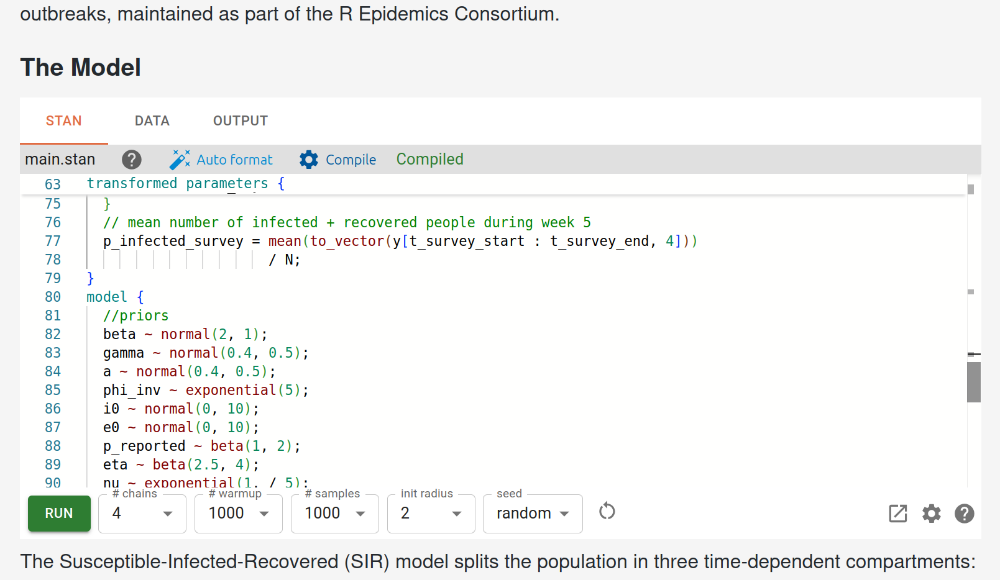

# Summary

[Stan Playground](https://stan-playground.flatironinstitute.org/) is an
in-browser editor and execution environment for Stan [@Carpenter2017; @Stan2025]
statistical models. Models and analyses run entirely locally with no
installation required. The only non-local computation required is on-demand
compilation, which is performed by a bespoke server that translates users'
models into WebAssembly modules built with the Emscripten [@emscripten2011]
toolchain. The server is available as code or a Docker image, and a free, public
server is provided, making this process transparent to the end user while still
allowing for customization.
Built-in sharing features and integration with Pyodide [@pyodide2021] and webR
[@Stagg2023] make Stan Playground a complete environment for instruction,
prototyping, and analysis.

# Statement of need

Stan is a language for statistical modeling commonly used for Bayesian data
analysis in many fields. Running a Stan program consists of two steps: model
_compilation_, where the users' Stan code is transpiled to C++ and compiled by a
C++ toolchain, and _sampling_, where the resulting model is executed to perform
statistical inference.

Because the models are themselves user-provided, model compilation requires end
users to have a working C++17 development environment installed in order to use
Stan. This requirement can be difficult to satisfy for users from less technical
backgrounds or with IT-imposed constraints on their systems. As a result,
installation-related questions are ubiquitous on the Stan forums. Installation
issues can be a particular pain point in learning environments, where
instructors do not want to spend a substantial fraction of their teaching time
just to ensure students have a working environment and copy of the relevant data
and models.

Thanks to its browser-based design requiring no installation, Stan Playground
allows users to immediately focus on the issues of modeling and analysis that
matter to them. A user simply navigates to
[https://stan-playground.flatironinstitute.org/](https://stan-playground.flatironinstitute.org/)
to get a blank project, or a student clicks on a link provided by their
instructor with code and data already populated. They can then begin editing,
compiling, and running Stan models immediately, regardless of their local system
configuration.

A similar level of convenience could be achieved by performing both compilation
and sampling on a centrally provided server, but there are several issues with
this approach. Sampling involves executing user-written code that could perform
potentially-unbounded amounts of compute. Offering this as a public service
would require authentication or rate-limiting. Additionally, even in a
restricted language like Stan, one would have to take serious precautions before
allowing untrusted user code to run unchecked.

By contrast, providing a public server that only performs compilation is secure
and practical. Compilation times are similar for most models and compilation
results can be cached, meaning e.g. students in a classroom setting would only
end up compiling the provided example once collectively. Furthermore,
compilation never executes any user-controlled code, obviating most security
concerns.

With Stan Playground, getting started with Stan can be reduced from a lengthy,
sometimes quite technical, process into loading a web page in any modern
browser.

# Key features

Stan Playground provides many features to allow end-to-end analysis projects to
be completed in the browser.

1. **Data Preparation**. The input data for the Stan model can be provided
   manually as JSON or generated by Python or R scripts which can download existing
   datasets or dynamically generate synthetic data.

2. **Model Editing**. The Stan editor in Stan Playground features integration
   with the Stan compiler to provide on-the-fly diagnostics and formatting.

3. **Compilation**. A premier feature of Stan Playground is the ability to
   compile and run without needing additional tools installed. This is achieved
   through a server that handles this compilation and provides WebAssembly modules
   back to the client. While a public server is hosted by the Flatiron Institute,
   users can also run their own and connect to that instead in the settings UI.

4. **Sampling**. Users can control the key parameters for the sampling algorithm
   (number of iterations, etc) and monitor progress in real time.

5. **Posterior Analysis**. Stan Playground provides many built-in diagnostics
   and visualizations for the posterior sample. Additionally, users can write
   Python or R scripts to leverage the existing ecosystem of tools such as ArviZ
   [@Kumar_ArviZ_a_unified] or `posterior` [@posterior2025].

6. **Sharing and Export**. Stan Playground by default saves the project in
   browser local storage. For longer-term storage, users can export their projects
   to zip files for local use, or upload to a Github Gist. GitHub Gist links
   facilitate easy sharing, as they can be used in URL parameters to load a
   specific project when a link is clicked. More customizable sharing options are
   also available through URL parameters.

7. **Embedding**. Stan Playground is able to be fully embedded using the
   `<iframe>` tag. A second UI layout which is more amenable to embedding is
   provided, and a custom element to make this easier is available in a small,
   no-dependency script. Blogs or documentation sites can use these to gain
   interactivity with minimal effort.

8. **Examples**. Stan Playground provides several example programs on the left
   sidebar of the home page at various levels of complexity, spanning from a basic
   linear regression on fake data to
   [a reimplementation of the model and analysis](https://stan-playground.flatironinstitute.org/?project=https://gist.github.com/WardBrian/d8ab811b137085f154b6145d3c36cbc4)
   from @Carpenter2018. The linked example uses Stan Playground's sharing features
   to pre-populate the project on page load.

# Implementation details

Stan Playground consists of two components. The first is a server that can
compile Stan models to WebAssembly, implemented in Python and leveraging the
existing Emscripten toolchain [@emscripten2011]. This server is also published
as a [Docker](https://www.docker.com/) image for users who wish to run a local
instance.

The remainder of the project is the user-facing web application, which can be found at
[https://stan-playground.flatironinstitute.org/](https://stan-playground.flatironinstitute.org/).

This web application is built on the [React](https://react.dev/) framework and
features various panels to allow editing of Stan models, compilation, sampling,
and downstream analysis of the results. The use of WebAssembly and browser Web
Workers to move computations off the main thread allows these computations to
complete quickly and without freezing the user interface.

# Acknowledgements

Andrew Gelman and Jonah Gabry from Columbia University offered valuable early
feedback on this project.

This project relies on `tinystan` [@tinystan2025], which was itself inspired by
Edward Roualdes' `BridgeStan` project [@Roualdes2023].

# References
